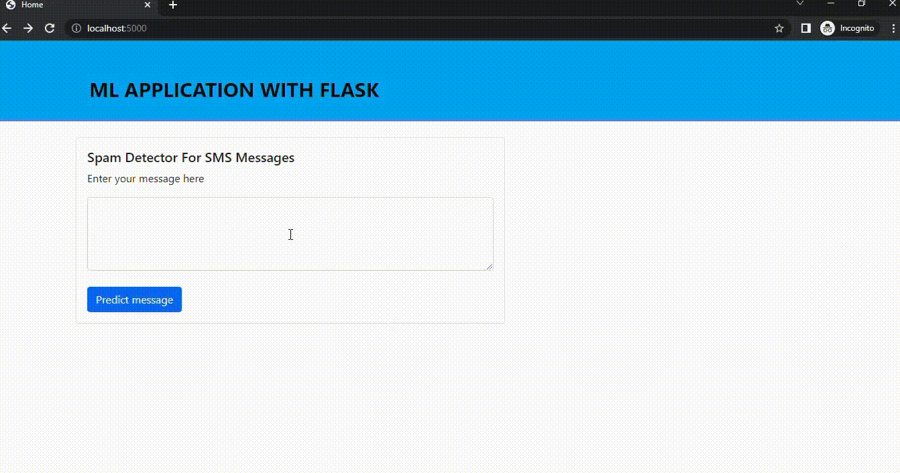

# Spam-Detector-For-SMS-Message


Building Flask API  to detect spam or ham message using Python and sklearn

## Overview

In this project, we use sms message  spam dataset to do text pre-processing and build flask api for machine learning web application.
Full Data can be found [here](https://github.com/fermat01/Spam-Detector-For-SMS-Message/blob/master/spam_data.csv) 

#### Differents machine learning algorithms  have been used

* Bagging Classification
* Random Forest Classification
* Extra Tree Classification
* Naive Bayes classification
* Decision tree Classification
* KNeighbors Classification
* SVM Classification


## Getting started

```
git clone https://github.com/fermat01/Spam-Detector-For-SMS-Message.git
cd Spam-Detector-For-SMS-Message
flask --app server --debug run
```

Go to url 
```
http://localhost:5000

```

An example of prediction on given sms message.





## TODO

